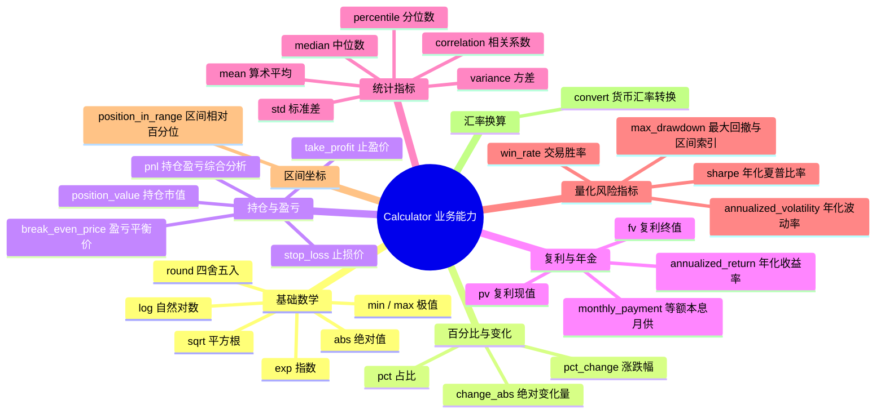
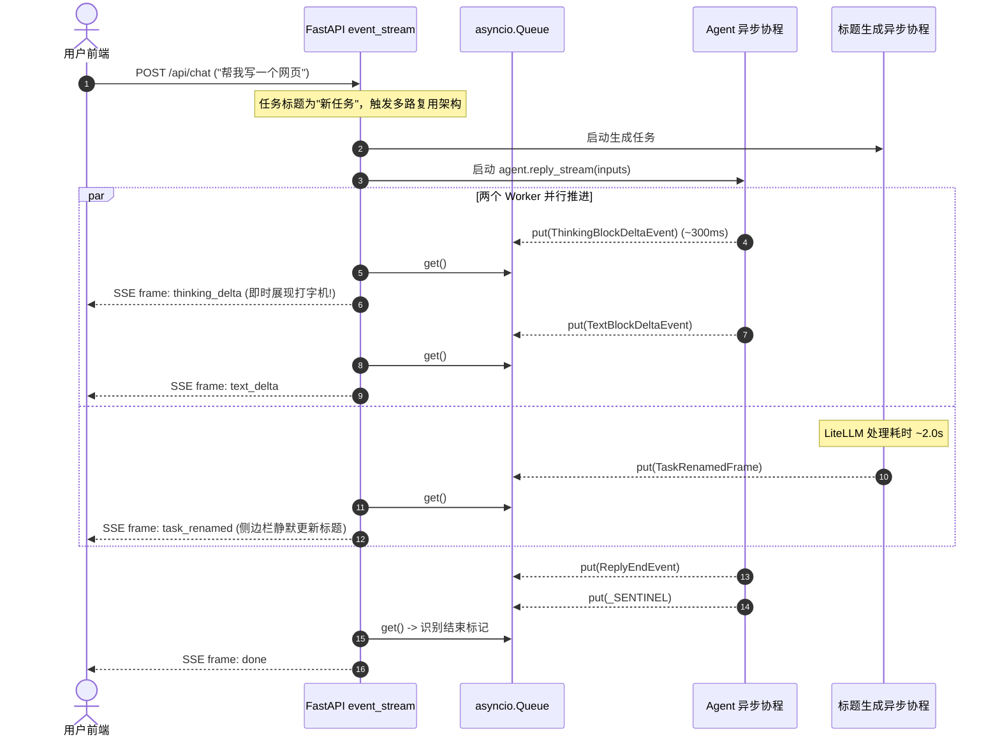

# 核心能力改进设计文档：金融计算器移植、首字延迟优化与系统提示透传

> **文档版本**：v1.0  
> **创建日期**：2026-10-01  
> **关联文档**：
> - [阶段一后端单 Agent 内核 Spec](2026-09-28-stage1-single-agent-design.md)（模块 C·计算器与工具集、模块 E·权限引擎）
> - [前端三栏工作台 Spec](2026-09-28-frontend-three-column-workbench.md)（§3.2 SSE 事件契约与流式协议）
> - [项目全局行为准则与演进路线](../../CLAUDE.md)（“严禁心算”规则、模型接入规范）
> - [项目待办清单](../../TODO.md)（待办事项第 12、17、18 项）
>
> **目标范围**：
> 针对代码与文档审查中确认的三个关键技术缺口，给出完备的端到端架构设计、数据契约、改动清单及测试验证方案。

---

## 目录

- [一、需求背景与目标](#一需求背景与目标)
- [二、问题 1：计算器业务能力完整移植（server/tools/calculator.py）](#二问题-1计算器业务能力完整移植servertoolscalculatorpy)
  - [2.1 现状与局限](#21-现状与局限)
  - [2.2 移植能力范围与算法矩阵](#22-移植能力范围与算法矩阵)
  - [2.3 架构设计：增强型 AST 安全表达式求值器](#23-架构设计增强型-ast-安全表达式求值器)
  - [2.4 返回值格式化与 AgentScope 集成](#24-返回值格式化与-agentscope-集成)
- [三、问题 2：首字响应延迟优化（server/main.py）](#三问题-2首字响应延迟优化servermainpy)
  - [3.1 瓶颈根因剖析](#31-瓶颈根因剖析)
  - [3.2 方案对比与架构选型](#32-方案对比与架构选型)
  - [3.3 详细设计：异步多路复用队列 (Queue Multiplexer)](#33-详细设计异步多路复用队列-queue-multiplexer)
  - [3.4 异常处理与连接断开防御](#34-异常处理与连接断开防御)
- [四、问题 3：`<system-reminder>` SSE 全链路透传（events.py + 前端）](#四问题-3system-reminder-sse-全链路透传eventspy--前端)
  - [4.1 机制分析与事件生命周期](#41-机制分析与事件生命周期)
  - [4.2 端到端数据契约定义](#42-端到端数据契约定义)
  - [4.3 后端翻译器实现细节](#43-后端翻译器实现细节)
  - [4.4 前端状态流转与 UI 呈现方案](#44-前端状态流转与-ui-呈现方案)
- [五、受影响文件与改动清单](#五受影响文件与改动清单)
- [六、质量保障与验证计划](#六质量保障与验证计划)

---

## 一、需求背景与目标

在前期迭代中，本项目已成功跑通通用 Agent 的端到端流式闭环、Redis 会话历史持久化、HITL 权限桥接以及待办事项全链路透传。但在系统体验与向股票分析场景平滑演进的过程中，存在以下三处亟待解决的不足：

1. **计算器工具仅具备基础四则运算**：
   - 当前 `server/tools/calculator.py` 仅能计算简易四则运算，缺乏股票分析项目（`/media/data/git/股票分析/.claude/skills/calculator/calculator.py`）中已验证的 Sharpe 比率、最大回撤（MDD）、持仓 PnL、年化波动率等核心金融算法。
   - 违反了项目长远规划与 `CLAUDE.md` 中 **“严禁心算（浮盈、回撤、复利必须调用计算器）”** 的要求。
2. **首次发消息首字存在明显的 2~3 秒阻塞**：
   - 任务在未起名状态（标题为“新任务”）时，`server/main.py` 在进入 `agent.reply_stream` 之前同步 `await title_task`，导致模型思考链或首个正文字符严重滞后，劣化了流式打字机的响应体验。
3. **系统环境提醒（HintBlockEvent）静默丢弃**：
   - AgentScope 2.0 在运行时会自动插入上下文提醒（如当前时间、工作区信息、待办摘要或上下文压缩预警），以 `HintBlockEvent` 形式发射。
   - 当前后端翻译器静默忽略该事件，前端无法获知模型感知到的外部系统约束。

**目标**：彻底解决上述三个缺陷，实现金融计算能力的无缝嵌入、首字响应时间的质的跃升（由 ~3 秒降至 ~300ms），以及系统运行时提示的全链路可见。

---

## 二、问题 1：计算器业务能力完整移植（server/tools/calculator.py）

### 2.1 现状与局限

现有 `server/tools/calculator.py` 代码行数仅 72 行，基于 Python 内置 `ast` 模块解析二元（`+ - * / // % **`）和一元操作符。其局限包括：
- 不支持任何函数调用（`ast.Call` 会直接抛出 `Unsupported expression element`）；
- 不支持列表/数组字面量（`ast.List`、`ast.Tuple` 不可用），无法传入时间序列数据；
- 缺乏金融、统计与仓位管理的核心方法。

### 2.2 移植能力范围与算法矩阵

直接移植原股票分析项目成熟的 `Calculator` 静态类，覆盖以下 8 大类数学与金融指标：



### 2.3 架构设计：增强型 AST 安全表达式求值器

为了在不改变现有工具接口签名的前提下让大模型自然调用，设计采用 **“增强型 AST 白名单调用机制”**。

#### 1. 安全求值原则
- **绝对禁用 `eval()` / `exec()`**：所有计算均通过 AST 语法树逐节点安全遍历。
- **严格函数白名单机制**：仅允许调用注册在 `_ALLOWED_FUNCS` 中的纯函数与 `Calculator` 静态方法，禁止任何带有下划线前缀、属性查找（`ast.Attribute`）或模块导入的行为。
- **支持复合嵌套调用**：模型既可以执行 `calculate("max_drawdown([27.69, 26.10, 25.00, 26.25, 23.96])")`，也可以执行复合表达式如 `calculate("position_value(300, 26.10) + 1500")`。

#### 2. AST 语法节点求值拓展

```python
def _eval_node(node: ast.AST) -> Any:
    # 1. 常量
    if isinstance(node, ast.Constant) and isinstance(node.value, (int, float, str, bool)):
        return node.value

    # 2. 基础二元与一元运算符（+ - * / // % **）
    if isinstance(node, ast.BinOp) and type(node.op) in _ALLOWED_BINOPS:
        return _ALLOWED_BINOPS[type(node.op)](_eval_node(node.left), _eval_node(node.right))
    if isinstance(node, ast.UnaryOp) and type(node.op) in _ALLOWED_UNARYOPS:
        return _ALLOWED_UNARYOPS[type(node.op)](_eval_node(node.operand))

    # 3. 数组与元组字面量（支持如 [1, 2, 3]）
    if isinstance(node, (ast.List, ast.Tuple)):
        return [_eval_node(elt) for elt in node.elts]

    # 4. 函数调用（仅限白名单中的函数名）
    if isinstance(node, ast.Call):
        if not isinstance(node.func, ast.Name):
            raise ValueError(f"仅支持直接调用白名单函数，不支持复杂属性或表达式调用: {ast.dump(node)}")
        func_name = node.func.id
        if func_name not in _ALLOWED_FUNCS:
            raise ValueError(f"未授权调用的函数: {func_name}")
        
        func = _ALLOWED_FUNCS[func_name]
        args = [_eval_node(arg) for arg in node.args]
        kwargs = {kw.arg: _eval_node(kw.value) for kw in node.keywords}
        return func(*args, **kwargs)

    raise ValueError(f"不支持的表达式元素: {ast.dump(node)}")
```

### 2.4 返回值格式化与 AgentScope 集成

`FunctionTool` 要求工具函数返回结构清晰的文本：
1. **标量数值**：保留精确结果，返回格式 `"{expression} = {result}"`；
2. **字典/多字段分析结果**（如 `pnl` 返回市值/成本/浮盈/收益率，`max_drawdown` 返回回撤比例与波谷波峰，`sharpe` 返回夏普比率）：
   - 将字典自动序列化为格式化 JSON 字符串；
   - 便于大模型准确提取每一个字段进行分析，杜绝心算或解析错位。
3. **安全权限**：
   - 保持在 `server/agent/core.py` 中显式赋予 `PermissionDecision(behavior=PermissionBehavior.ALLOW)`，确保纯函数计算不产生多余的 HITL 确认弹窗。

---

## 三、问题 2：首字响应延迟优化（server/main.py）

### 3.1 瓶颈根因剖析

当前 `server/main.py` 的 `/api/chat` 处理逻辑：

```python
# 现状代码
if task.title == "新任务":
    title_task = asyncio.create_task(generate_title(payload.message))

async def event_stream():
    ...
    if title_task is not None:
        new_title = await title_task   # 🚨 串行阻塞点！
        task_manager.update_task(payload.task_id, title=new_title)
        yield sse_frame("task_renamed", {"title": new_title})

    # 直到 title_task 完成后，才开始调用 agent.reply_stream
    async for event in agent.reply_stream(inputs):
        ...
```

**问题本质**：标题生成调用的是外部 LLM（即便使用最轻量的 `Gemini-Flash-Lite`，首包网络往返通常也需要 1.5 ~ 3 秒）。由于在该任务结束前主对话循环未启动，导致前端页面在 2~3 秒内完全处于白屏/空等待状态，首字打字机延迟被严重拉长。

### 3.2 方案对比与架构选型

| 方案 | 原理 | 优点 | 缺点 | 结论 |
|------|------|------|------|------|
| **方案 A：轮询检查法** | 在 `agent.reply_stream` 迭代中每次检查 `title_task.done()` | 改动小，代码直观 | 若 Agent 思考时间很长且中间无事件，标题帧可能延迟发出 | 备选 |
| **方案 B：异步队列多路复用 (Queue Multiplexer)** | 独立的异步生产者推送到一个 `asyncio.Queue`，主生成器仅消费队列 | 彻底解耦，谁快谁先发，首字零延迟，拓展性最强 | 需要妥善处理异常与退出 Sentinel 标记 | **推荐采纳** |

### 3.3 详细设计：异步多路复用队列 (Queue Multiplexer)



#### 核心实现伪代码

```python
async def event_stream():
    queue: asyncio.Queue[str | object] = asyncio.Queue()
    _SENTINEL = object()

    # 1. 后台消费 Agent 消息流
    async def run_agent():
        try:
            async for event in agent.reply_stream(inputs):
                if isinstance(event, RequireUserConfirmEvent):
                    # 处理 HITL 确认...
                    ...
                for frame in translator.translate(event):
                    await queue.put(frame)
                if isinstance(event, ReplyEndEvent):
                    # 补充产物与待办帧
                    ...
                    await task_manager.save_agent_state(payload.task_id)
        except Exception as exc:
            await queue.put(sse_frame("text_delta", {"text": f"\n\n[后端错误: {exc}]"}))
            await queue.put(sse_frame("done", {"task_status": "failed"}))
        finally:
            await queue.put(_SENTINEL)

    # 2. 后台监听标题生成（仅在需要时）
    async def run_title():
        if title_task is None:
            return
        try:
            new_title = await title_task
            task_manager.update_task(payload.task_id, title=new_title)
            await queue.put(sse_frame("task_renamed", {"title": new_title}))
        except Exception as exc:
            logger.warning("标题生成失败，保持默认标题: %s", exc)

    # 并发启动后台 Worker
    agent_task = asyncio.create_task(run_agent())
    if title_task is not None:
        asyncio.create_task(run_title())

    # 主 SSE 循环消费队列
    while True:
        item = await queue.get()
        if item is _SENTINEL:
            break
        yield item
```

### 3.4 异常处理与连接断开防御

1. **标题超时兜底**：`title_task` 设定最大超时（5 秒），超时直接降级放弃，保证不阻塞资源。
2. **连接意外中断**：当客户端中途断开连接（如用户关闭标签页）时，`StreamingResponse` 会抛出 `CancelledError`，`finally` 块确保取消未完成的 background tasks，避免协程泄漏。
3. **状态持久化原子性**：`save_agent_state` 仅在 Agent 完整运行完毕（`ReplyEndEvent`）后执行，保持会话快照与实际输出严格一致。

---

## 四、问题 3：`<system-reminder>` SSE 全链路透传（events.py + 前端）

### 4.1 机制分析与事件生命周期

AgentScope 2.0 在以下场景会自动产生 `HintBlock` 并通过 `reply_stream` 广播 `HintBlockEvent`：
- **运行时环境注入**（时区、时钟、当前工作区）；
- **上下文超限提醒**（触发压缩前的倒计时告警）；
- **长文本记忆召回与 RAG**；
- **任务目标达成与强制工具约束**。

其内部数据结构如下：
```python
class HintBlockEvent(EventBase):
    type: Literal[EventType.HINT_BLOCK] = EventType.HINT_BLOCK
    reply_id: str
    block_id: str
    source: str | None = None
    hint: str | List[TextBlock | DataBlock]
```

### 4.2 端到端数据契约定义

#### 1. SSE 线路协议新增事件

```http
event: system_reminder
data: {"block_id": "hint_001", "source": "system", "content": "Current Time: 2026-10-01 15:30:00 (UTC)..."}
```

- `event`：固定为 `system_reminder`；
- `block_id` (`string`)：该提示块的全局唯一标识；
- `source` (`string`)：提示来源，默认 `"system"`；
- `content` (`string`)：格式化后的提示纯文本。

#### 2. 双端契约同步
- **后端**：在 `server/service/events.py` 的 `EVENT_NAMES` 集合中加入 `"system_reminder"`；
- **前端**：在 `frontend/src/api/events.ts` 的 `EVENT_NAMES` 数组中同步追加 `"system_reminder"`，并在 `SseEventPayloadMap` 中定义类型接口。

### 4.3 后端翻译器实现细节

在 `server/service/events.py` 的 `AgentEventTranslator.translate` 中增加分支：

```python
if isinstance(event, HintBlockEvent):
    if isinstance(event.hint, str):
        content_text = event.hint
    elif isinstance(event.hint, list):
        content_text = "".join(
            block.text for block in event.hint if hasattr(block, "text")
        )
    else:
        content_text = str(event.hint)

    return [
        sse_frame(
            "system_reminder",
            {
                "block_id": event.block_id,
                "source": event.source or "system",
                "content": content_text,
            },
        )
    ]
```

### 4.4 前端状态流转与 UI 呈现方案

1. **Pinia 会话存储扩展 (`frontend/src/store/session.ts`)**：
   - 在 `ChatMessage` 类型中扩展可选字段 `systemReminders?: Array<{ blockId: string; content: string; source: string }>`；
   - `applyFrame` 接收到 `system_reminder` 时，将提醒追加到当前流式消息的 `systemReminders` 列表中。
2. **UI 交互与呈现原则**：
   - **非侵入式**：严禁将 `<system-reminder>` 混入用户的正常回答打字机正文中；
   - **折叠展示**：在消息气泡上方或思考链折叠块内部，以微型灰色标签展示（例如：`🏷 系统提示 (运行时环境)`，点击可展开查看详情）。

---

## 五、受影响文件与改动清单

| 模块 | 文件路径 | 状态 | 改动说明 |
|------|---------|------|---------|
| **计算器** | `server/tools/calculator.py` | 修改 | 引入完整 `Calculator` 类，扩展 AST 求值器支持 `ast.Call`、`ast.List` 及白名单函数 |
| **计算器单测** | `tests/test_calculator.py` | 修改 | 增加 Sharpe、最大回撤、PnL、复利、非法函数拦截的完整单测用例 |
| **首字延迟** | `server/main.py` | 修改 | 重构 `event_stream`，使用 `asyncio.Queue` 实现 `title_task` 与 `agent.reply_stream` 并发多路复用 |
| **事件契约** | `server/service/events.py` | 修改 | `EVENT_NAMES` 增加 `system_reminder`，实现 `HintBlockEvent` 的翻译逻辑 |
| **事件单测** | `tests/test_events.py` | 修改 | 增加 `HintBlockEvent` 序列化与白名单校验单测 |
| **前端契约** | `frontend/src/api/events.ts` | 修改 | 同步在 `EVENT_NAMES` 注册 `system_reminder` 并补充 TypeScript 类型声明 |
| **前端状态** | `frontend/src/store/session.ts` | 修改 | 处理 `system_reminder` 事件帧，记录系统提示元数据 |
| **待办追踪** | `TODO.md` | 修改 | 更新待办项 12、17、18 的进展状态 |

---

## 六、质量保障与验证计划

### 6.1 单元测试要求 (TDD)
1. **计算器全面覆盖测试**：
   - 基础运算回归：`1 + 2 * 3`、`2 ** 4`；
   - 百分比与涨跌：`pct_change(25.90, 26.10)` 期望 `~0.7722%`；
   - 持仓盈亏：`pnl(300, 25.554, 26.10)` 准确验证市值、成本与收益率字段；
   - 最大回撤：`max_drawdown([27.69, 26.10, 25.00, 26.25, 23.96, 26.10])` 验证谷值波峰及恢复点；
   - 夏普比率：`sharpe([0.01, 0.02, -0.005, 0.015], rf=0.0)` 验证年化夏普比率；
   - 安全边界防线：`__import__('os')`、`eval('1')`、`open('/etc/passwd')` 等恶意输入必须抛出异常并被捕获为错误提示。
2. **事件翻译测试**：
   - 针对 `HintBlockEvent` 输入，验证输出的 SSE 文本符合 `event: system_reminder\ndata: {...}\n\n` 规范。

### 6.2 端到端集成验证
1. **首字延迟实测**：
   - 在测试中 mock 一个强制 `asyncio.sleep(2.0)` 的 `title_task`；
   - 启动 `/api/chat` 请求，断言首个 `thinking_delta` 或 `text_delta` 在 300ms 内收到，验证 `task_renamed` 在 2.0s 左右穿插送达。
2. **前端与后端无缝联调验证**：
   - 运行前端 `npm run build` 和 `npm run type-check`，确保契约变更零类型错误；
   - 运行后端 pytest 全量套件，确保 100% 通过。
