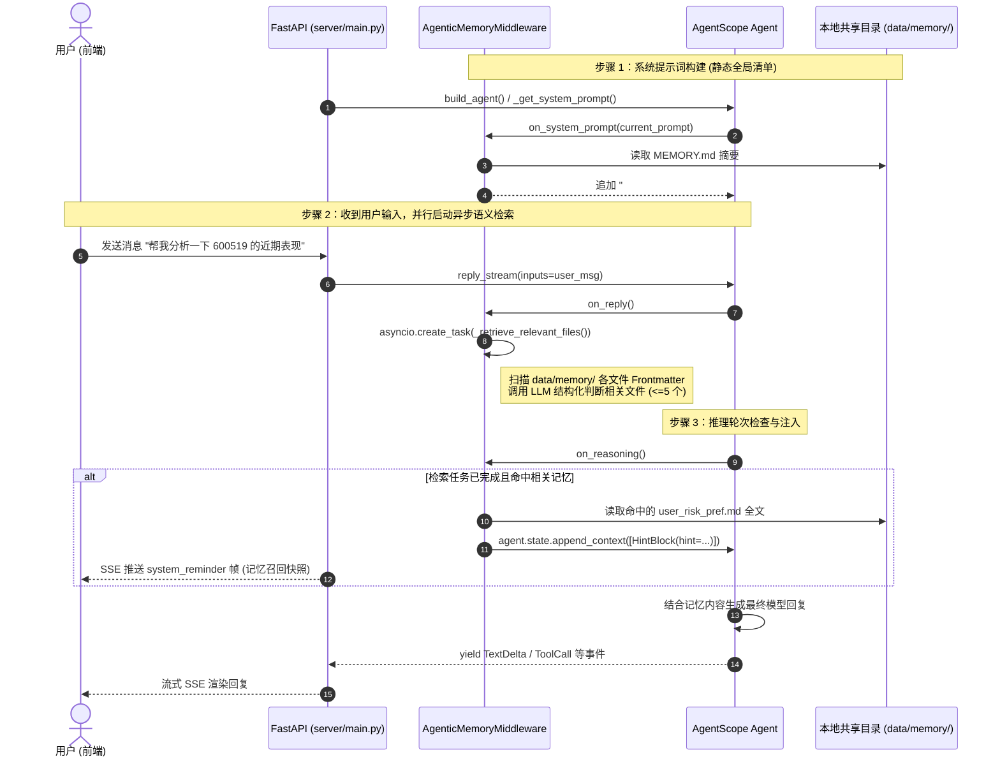

# 长期记忆 (Long-term Memory) 架构设计与实施规范

> **文档版本**：v1.0  
> **创建日期**：2026-10-01  
> **状态**：方案设计阶段（待确认后实施）  
> **文档位置**：`docs/specs/2026-10-01-longterm-memory-design.md`  
> **关联规范**：
> - [阶段一单 Agent 内核设计（模块 D：记忆管理）](2026-09-28-stage1-single-agent-design.md)
> - [会话与记忆管理落地设计](2026-09-30-conversation-memory-management.md)
> - [核心改进设计（HintBlock 透传与计算器）](2026-10-01-core-improvements-design.md)

---

## 一、背景与设计目标

### 1.1 三层记忆体系全景
在 `s_agent` 智能体架构中，记忆体系由三层协同支撑：

| 记忆层级 | 生命周期 | 存储介质 | 核心用途 | 现状 |
|---|---|---|---|---|
| **短时会话记忆 (Short-term Context)** | 单个 Task / 会话 | 内存 `AgentState.context` + Redis 备份 | 保持当前任务的多轮对话上下文 | ✅ 已实现 |
| **上下文卸载 (Context Offload)** | 单个 Task / 工作区 | 本地磁盘 `sessions/<session_id>/` | 工具大输出（>8000 tokens）确定性截断落盘与指针按需回读 | ✅ 已实现 |
| **长期记忆 (Long-term Memory)** | 跨 Task / 跨 Session 永久有效 | 共享存储目录 `data/memory/` | 跨任务沉淀用户画像/偏好、交互准则、股票业务经验与事实 | 🎯 **本次设计** |

### 1.2 核心目标
1. **跨任务沉淀与共享**：无论用户在哪个工作区（Workspace）或哪个任务（Task）中表达偏好（如“我偏好稳健型投资，每次分析股票都必须计算夏普比率与最大回撤”），其它任务在后续执行时均能自动感知并遵循。
2. **零重依赖与高可解释性**：不引入 Milvus / Qdrant / Chroma 等外部重型向量数据库（避免复杂的 C 扩展、运维成本与不可解释性），采用人类可读、可版本控制、可手工校阅的结构化 Markdown 记忆卡片。
3. **两级分层检索（低消耗 + 高召回）**：
   - **全局索引级（Prompt Caching 友好）**：在 System Prompt 末尾常驻紧凑的 `MEMORY.md` 记忆清单，模型随时感知已有记忆；
   - **语义检索级（异步并行召回）**：用户发来请求时，并发启动基于轻量级 LLM 的记忆匹配，将强相关的记忆卡片全文封装为 `HintBlock` 注入当前轮次上下文。
4. **双向生命周期管理**：支持智能体自主记录/更新，也支持用户通过自然语言显式管理（增、删、改、查）。

---

## 二、架构选型与权衡分析

### 2.1 候选方案对比

| 评估维度 | 方案 A：外部向量数据库 + 传统 RAG | 方案 B：Agentic 结构化 Markdown 记忆库（推荐） | 方案 C：纯 Redis Key-Value 静态注入 |
|---|---|---|---|
| **技术底座** | `agentscope.rag.KnowledgeBase` + Milvus/Qdrant | `agentscope.middleware.AgenticMemoryMiddleware` | 自定义 Redis 读写中间件 |
| **外部依赖** | 需额外安装向量库客户端及运行向量容器 | **零额外依赖**（AgentScope 2.0.8 原生内置） | 依赖既有 Redis |
| **数据透明度** | 向量 Embedding 浮点数，黑盒不可读 | **纯 Markdown 文件**，用户可直接在工作台查看/修改 | JSON 字符串，可读性中等 |
| **检索精准度** | 依赖语义相似度（易出现近义词误召回） | **LLM 意图判断 + Frontmatter 触发规则**，判断极其精准 | 简单 Key 前缀或无检索全量拼装 |
| **记忆更新维护** | 向量删除与更新存在延迟与碎片 | **原子化 Markdown 文件替换**，删除更新极简 | 覆盖更新容易，语义关联弱 |
| **冷启动性能** | 需对文档 chunking 和 embedding 计算 | 毫秒级文件扫读，异步召回不阻碍首字生成 | 快 |

**选型结论**：采用 **方案 B（Agentic 结构化 Markdown 记忆库）**。该方案与本项目推崇的“最小代码、高可控性、原子化知识沉淀（参考 `.learnings/`）”理念完全契合，且 AgentScope 2.0.8 官方深度支持并提供了完整的中间件生命周期挂钩。

---

## 三、系统架构与数据模型

### 3.1 目录布局与存储位置

长期记忆作为跨任务的全局共享资产，独立于单个任务的 `workspaces/<task_id>/` 目录，统一存放在项目根目录的持久化数据区：

```
s_agent/
├── data/
│   └── memory/                     <--- config.LONGTERM_MEMORY_DIR (已在 .gitignore 中保护)
│       ├── MEMORY.md               <--- 全局记忆索引清单（自动同步维护）
│       ├── user_risk_pref.md       <--- 用户偏好卡片 (type: user)
│       ├── feedback_metrics.md     <--- 纠错/交互准则卡片 (type: feedback)
│       ├── stock_watchlist.md      <--- 领域业务上下文卡片 (type: project)
│       └── ref_financial_docs.md   <--- 外部引用卡片 (type: reference)
```

> **Git 隔离策略**：根目录 `.gitignore` 已配置 `data/` 目录忽略，保证用户的本地偏好和私有记忆不会被误提交至代码仓库。

### 3.2 记忆卡片规范（Markdown + YAML Frontmatter）

每个记忆卡片文件必须专注于**单一主题**，包含标准的 Frontmatter 元数据及结构化的正文：

```markdown
---
name: user_risk_preference
description: 记录用户的投资风险偏好、仓位限制及关注的股票标的
type: user
---

# 用户投资偏好

用户偏好稳健型（价值投资）策略：
- 单票持仓比例不超过 20%；
- 重点关注沪深 300 成分股及高股息蓝筹股（如贵州茅台 600519）；
- 核心要求：所有股票分析报告必须包含夏普比率（Sharpe Ratio）与最大回撤（Max Drawdown）指标。
```

#### Frontmatter 字段定义：
1. `name` (`str`, 必须)：记忆卡片唯一英文标识符（驼峰或下划线命名）；
2. `description` (`str`, 必须)：**检索触发条件（Retrieval Trigger）**。用一句话明确说明“在何种情境/提问下未来必须召回此记忆”，LLM 匹配器将重点比对本字段；
3. `type` (`str`, 必须)：记忆分类，取值范围：
   - `user`：用户画像、角色、专业背景、投资风格与硬性要求；
   - `feedback`：用户纠错（“不要做 X”、“必须做 Y”）与经过验证的有效方法；
   - `project`：长期股票业务上下文、特定股票池、定期审计规范；
   - `reference`：外部数据源接口、参考链接与指标公式说明。

### 3.3 索引文件规范 (`MEMORY.md`)

`MEMORY.md` 仅作为目录索引，每行一个条目，格式严格统一，保持紧凑（行数控制在 200 行以内以适应 Token 预算）：

```markdown
- [user_risk_preference](user_risk_pref.md) (2026-10-01): 记录用户的投资风险偏好、仓位限制及关注的股票标的
- [feedback_metrics](feedback_metrics.md) (2026-10-01): 股票量化计算必须使用内置 AST 计算器
```

---

## 四、全链路检索与上下文注入机制

### 4.1 检索与执行时序图



### 4.2 双层注入机制详解

1. **第一层：全局清单静态注入 (`on_system_prompt`)**
   - 每次调用 `_get_system_prompt()` 时，读取 `MEMORY.md`。
   - 截断保护：如果索引超出 `config.LONGTERM_MEMORY_MAX_TOKENS`（默认 4000 tokens），自动截断并附带 `<system-reminder>` 说明。
   - 作用：智能体在零检索开销下即可知晓“有哪些维度的记忆已被登记”，当遇到记忆更新诉求时，无需遍历磁盘即可定位已有文件名。

2. **第二层：动态异步语义召回 (`on_reply` + `on_reasoning`)**
   - 当用户发送新一轮对话消息后，中间件提取 `query`，异步调用轻量级模型进行结构化输出匹配：
     ```python
     class _MemorySelection(BaseModel):
         selected_files: list[str] = Field(description="命中的记忆文件列表，至多 5 个")
     ```
   - 召回校验：中间件对模型返回的文件名进行白名单过滤，防止幻觉；
   - 动态注入：将命中的 Markdown 文件按 Token 预算（单个文件上限默认 2000 tokens）截断，包装为 `HintBlock(hint=...)` 追加到 `agent.state`。
   - **前端可视化联动**：此前我们已打通了 `HintBlockEvent -> SSE(system_reminder) -> 前端渲染` 链路，因此被召回的记忆内容能立刻在前端对话气泡上方优雅呈现给用户，透明可见！

---

## 五、记忆生命周期与读写流程

### 5.1 智能体自主沉淀记忆
在系统提示词中明确规范（中文本地化指令）：
1. **触发识别**：
   - 用户明确声明：“记住……”、“我以后希望……”、“我更关注……”；
   - 用户纠错：“不要这样做”、“这里算错了，应该用 Sharpe”；
   - 形成长期有效的业务规律。
2. **两步保存流程**：
   - **第 1 步**：调用 `Write` 工具将卡片内容写入 `data/memory/<filename>.md`（包含合法的 YAML Frontmatter）；
   - **第 2 步**：更新 `data/memory/MEMORY.md` 索引清单，追加单行描述。
3. **更新与遗忘**：
   - 若用户指出旧偏好过时，调用 `Write`/`Edit` 更新对应卡片或移除条目。

### 5.2 权限与路径安全
- `Write` 工具使用 `LocalBackend`，其目标路径在 `data/memory/` 范围内；
- 该目录不包含敏感系统路径（`.git`、`.ssh`、`.env` 均在 AgentScope 危险路径黑名单中，受到底层硬拦截保护）；
- 评估 HITL 策略：`Write` 工具操作 `data/memory/` 目录时，将生成待确认事件，用户在前端点击“允许”后落盘，保障用户对长期记忆沉淀的最高知情权与控制权。

---

## 六、配置参数规范 (`server/config.py`)

在 `server/config.py` 中新增长期记忆的专属配置项与环境变量映射：

```python
# --- Long-term Memory (跨任务持久化记忆) ---
# 是否启用长期记忆中间件
LONGTERM_MEMORY_ENABLED = os.getenv("S_AGENT_LONGTERM_MEMORY_ENABLED", "true").lower() == "true"

# 长期记忆根目录（跨任务共享，默认位于 data/memory）
LONGTERM_MEMORY_DIR = Path(
    os.getenv("S_AGENT_LONGTERM_MEMORY_DIR", str(REPO_ROOT / "data" / "memory")),
)

# MEMORY.md 索引常驻 System Prompt 的最大 Token 限制
LONGTERM_MEMORY_MAX_TOKENS = int(
    os.getenv("S_AGENT_LONGTERM_MEMORY_MAX_TOKENS", "4000"),
)

# 每次异步召回单篇记忆文件的最大 Token 限制（防上下文冲刷）
LONGTERM_MEMORY_RETRIEVAL_MAX_TOKENS = int(
    os.getenv("S_AGENT_LONGTERM_MEMORY_RETRIEVAL_MAX_TOKENS", "2000"),
)
```

---

## 七、实施计划与测试用例规划

### 7.1 代码改动点清单
1. **配置层**：[`server/config.py`](file:///media/data/git/s_agent/server/config.py)
   - 添加 `LONGTERM_MEMORY_ENABLED`、`LONGTERM_MEMORY_DIR`、`LONGTERM_MEMORY_MAX_TOKENS` 等环境变量解析；
2. **中间件定制与装配**：[`server/agent/core.py`](file:///media/data/git/s_agent/server/agent/core.py)
   - 引入 `AgenticMemoryMiddleware`；
   - 编写贴合中文与金融股票场景的 `CHINESE_MEMORY_INSTRUCTIONS` 替代默认英文说明；
   - 在 `build_agent()` 中装配 `middlewares=[memory_middleware]`；
3. **目录初始化**：在服务启动或 `build_agent` 时自动幂等创建 `config.LONGTERM_MEMORY_DIR` 并初始化空白的 `MEMORY.md`。

### 7.2 单元与集成测试规划 (`tests/test_longterm_memory.py`)
编写完整的自动化测试套件：
- `test_memory_layout_initialization`：验证首次启动时 `MEMORY.md` 正确创建在 `data/memory/`；
- `test_system_prompt_includes_memory_manifest`：验证 System Prompt 正确追加了 `MEMORY.md` 中的条目与说明；
- `test_memory_frontmatter_parsing`：验证 Frontmatter 的解析准确性及容错性；
- `test_memory_retrieval_matching`：验证给出相关提问时，能够精准命中特定主题卡片；
- `test_memory_retrieval_filtering_unrelated`：验证无关提问不会误召回记忆；
- `test_cross_task_memory_sharing`：验证在 Task A 创建的记忆卡片，在 Task B 中能无缝被检索到。

---

## 八、总结与下一步操作

本设计以极简、高透明度、零外部数据库依赖的结构化 Markdown 方式，落地了规范「模块 D」中跨会话长期记忆的构想，并与现有系统的 Context Offload、Redis 对话持久化、SSE 透传完美协同。

请您 Review 本设计文档。确认方案无误后，我将按照本设计开始编写测试与核心代码。
