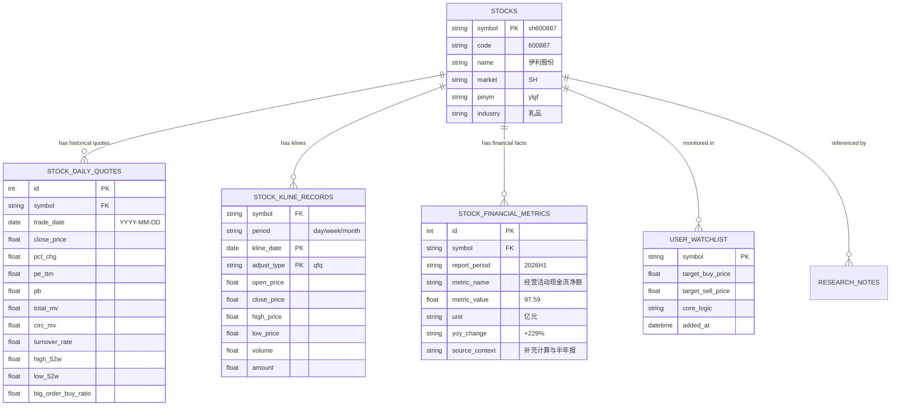
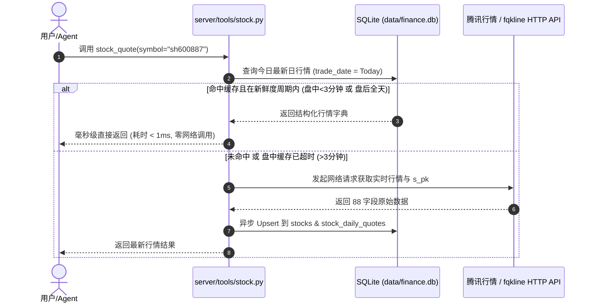

# 结构化金融数据跨会话持久化与缓存系统设计方案

> **文档状态**：PROPOSED  
> **编写日期**：2026-10-01  
> **作者**：Antigravity Agent  
> **需求背景**：在当前股票分析 Agent 交互中，行情、估值、历史K线、财务测算与研报数据散落在单次对话上下文中，缺乏统一结构化沉淀，导致跨会话数据割裂、同一标的反复请求外网接口。本方案基于 SQLite WAL 引擎，针对腾讯自选股接口数据特点与基本面投研事实，系统性设计跨会话结构化存储与透明缓存体系。

---

## 1. 深度分析：哪些数据应该存入数据库？

从腾讯自选股接口（`qt.gtimg.cn`、`fqkline`、`smartbox`）以及 Tavily 全网研报中可提取极为丰富的数据。我们根据**数据时效性、变更频率、跨会话复用价值与查询复杂度**，进行详细的价值分层与存储决策。

### 1.1 数据分层与准入决策矩阵

| 数据分类 | 来源接口 / 场景 | 数据特征 | 跨会话复用价值 | 存储决策 |
| :--- | :--- | :--- | :--- | :--- |
| **A. 标的元数据** | `smartbox` 联想接口 | 极度稳定，名称/代码/市场几乎不变 | ⭐⭐⭐⭐⭐ 基础字典，智能联想与校验必备 | **必须入库** (`stocks`)，永久保留 |
| **B. 核心估值与日行情快照** | `qt.gtimg.cn/q={sym}` | 日内高频，盘后固化为静态交易日快照 | ⭐⭐⭐⭐⭐ 估值水位线分析、跨标的横向对比核心 | **必须入库** (`stock_daily_quotes`)，按日快照 |
| **C. 筹码与大单分布** | `qt.gtimg.cn/q=s_pk{sym}` | 日内博弈指标，随收盘归档 | ⭐⭐⭐⭐ 判断主力资金博弈倾向 | **合并入库**，作为日行情扩展字段 |
| **D. 历史 K 线序列** | `web.ifzq.gtimg.cn/fqkline` | 历史区间为**不可变客观事实** | ⭐⭐⭐⭐⭐ 均线系统、回测、长线形态分析基石 | **增量入库** (`stock_kline_records`)，永久有效 |
| **E. 深度财务测算事实** | 用户输入 / 财报 / Tavily 研报 | 高价值非标数据（现金流、分红、负债率） | ⭐⭐⭐⭐⭐ 价值投资决策的核心财务底稿 | **必须入库** (`stock_financial_metrics`) |
| **F. 用户自选与持仓目标** | 用户交互与投资偏好 | 强个性化、跨会话长期跟踪 | ⭐⭐⭐⭐⭐ 资产跟踪与风险警报枢纽 | **必须入库** (`user_watchlist`) |
| **G. 研报观点与资讯摘要** | Tavily 搜索与抽取 | 结构化摘要、催化剂与风险提示 | ⭐⭐⭐⭐ 历史研报观点可追溯 | **按需入库** (`research_notes`) |
| **H. 买卖五档瞬时盘口** | `qt.gtimg.cn` 买一至卖五 | 秒级瞬变，具有极强时效性 | ⭐ 盘后无统计价值，膨胀存储空间 | **严禁入库**（仅保留内存 3 秒缓存） |
| **I. 逐分钟分时明细** | `stock_minute` (240点/天) | 数据量大，仅当日交易执行有效 | ⭐⭐ 跨会话分析价值低 | **暂不入库**（仅文件或内存临时缓存） |

---

### 1.2 腾讯股票接口深度挖掘：哪些字段最值得结构化沉淀？

经实测，腾讯完整的 `qt.gtimg.cn/q={symbol}` 返回多达 **88 个字段**。经筛选，以下 22 项核心指标对投研分析最具价值，需在表结构中显式定义列：

1. **基本量价**：最新价 (`[3]`)、昨收价 (`[4]`)、今开价 (`[5]`)、最高价 (`[33]`)、最低价 (`[34]`)、涨跌额 (`[31]`)、涨跌幅% (`[32]`)、振幅% (`[43]`)；
2. **量能指标**：成交量手 (`[6]`)、成交金额万元 (`[37]`)、换手率% (`[38]`)；
3. **估值指标**：
   - **TTM 市盈率** (`[53]`)：最公允的滚动估值；
   - **动态市盈率** (`[39]`)：基于预测或年化；
   - **静态市盈率** (`[54]`)：基于上一年度年报；
   - **市净率 PB** (`[46]`)：重资产/破净分析；
4. **市值与股本**：总市值亿元 (`[45]`)、流通市值亿元 (`[44]`)、总股本股 (`[73]`)、流通股本股 (`[72]`)；
5. **周期极限**：52 周最高价 (`[67]`)、52 周最低价 (`[68]`)——衡量当前价格在一年中所处相对位置的关键指标；
6. **盘口筹码**：外盘/主动买手 (`[7]`)、内盘/主动卖手 (`[8]`)、大单买入比 (`s_pk[0]`)、大单卖出比 (`s_pk[2]`)。

---

## 2. 存储引擎选型：SQLite (WAL 模式) 的架构优势

选用嵌入式关系型数据库 SQLite，持久化文件设为 **`data/finance.db`**：

1. **零外部依赖**：Python 标准库自带 `sqlite3`，开箱即用，无需维护额外服务容器；
2. **高并发读写能力（WAL 模式）**：
   通过开启 `PRAGMA journal_mode = WAL;`，读事务与写事务互不阻塞（Readers do not block writers, and writers do not block readers），完全能够胜任多任务、多 Agent 并发访问；
3. **强类型与约束保障**：支持标准 SQL、联合主键唯一约束（`UNIQUE(symbol, trade_date)`），天然支持 `INSERT ... ON CONFLICT DO UPDATE` 幂等写入，彻底解决并发脏写与数据重复问题；
4. **便于调试与导出**：单文件易于备份、迁移，并可通过现有 Python 代码无缝导出为 Excel / CSV 交付物。

---

## 3. 数据库表结构设计（DDL Schema）



### 3.1 标的元数据表（`stocks`）
```sql
CREATE TABLE IF NOT EXISTS stocks (
    symbol VARCHAR(32) PRIMARY KEY,       -- 标准化代码，如 sh600887, sz000858, usAAPL
    code VARCHAR(16) NOT NULL,            -- 纯数字/字母代码，如 600887
    name VARCHAR(64) NOT NULL,            -- 中文名称，如 伊利股份
    market VARCHAR(16) NOT NULL,          -- 市场：SH, SZ, HK, US
    pinyin VARCHAR(32),                   -- 拼音简写：ylgf
    industry VARCHAR(64),                 -- 行业或板块
    sec_type VARCHAR(16) DEFAULT 'GP-A',  -- 标的类型：GP-A, ETF, INDEX
    created_at TIMESTAMP DEFAULT CURRENT_TIMESTAMP,
    updated_at TIMESTAMP DEFAULT CURRENT_TIMESTAMP
);
CREATE INDEX IF NOT EXISTS idx_stocks_name ON stocks(name);
CREATE INDEX IF NOT EXISTS idx_stocks_code ON stocks(code);
CREATE INDEX IF NOT EXISTS idx_stocks_pinyin ON stocks(pinyin);
```

### 3.2 估值与日行情快照表（`stock_daily_quotes`）
```sql
CREATE TABLE IF NOT EXISTS stock_daily_quotes (
    id INTEGER PRIMARY KEY AUTOINCREMENT,
    symbol VARCHAR(32) NOT NULL,          -- 股票标准代码
    trade_date DATE NOT NULL,             -- 交易日：YYYY-MM-DD
    close_price REAL NOT NULL,            -- 收盘价 / 现价
    prev_close REAL,                      -- 昨收价
    open_price REAL,                      -- 今开盘
    high_price REAL,                      -- 最高价
    low_price REAL,                       -- 最低价
    pct_chg REAL NOT NULL,                -- 涨跌幅 (%)
    chg_amount REAL,                      -- 涨跌额
    amplitude REAL,                       -- 振幅 (%)
    volume_lot INTEGER,                   -- 成交量 (手)
    amount_wan REAL,                      -- 成交额 (万元)
    turnover_rate REAL,                   -- 换手率 (%)
    pe_ttm REAL,                          -- 滚动市盈率 (PE TTM)
    pe_dynamic REAL,                      -- 动态市盈率
    pe_static REAL,                       -- 静态市盈率
    pb REAL,                              -- 市净率 (PB)
    total_mv REAL,                        -- 总市值 (亿元)
    circ_mv REAL,                         -- 流通市值 (亿元)
    high_52w REAL,                        -- 52周最高价
    low_52w REAL,                         -- 52周最低价
    outer_bid INTEGER,                    -- 外盘 (主动买入 手)
    inner_bid INTEGER,                    -- 内盘 (主动卖出 手)
    active_buy_ratio REAL,                -- 外盘占比 (0~1)
    big_order_buy_ratio REAL,             -- 大单买入占比 (来自 s_pk)
    big_order_sell_ratio REAL,            -- 大单卖出占比 (来自 s_pk)
    raw_payload JSON,                     -- 原始字段快照备份
    updated_at TIMESTAMP DEFAULT CURRENT_TIMESTAMP,
    UNIQUE(symbol, trade_date)            -- 联合唯一主键，同一标的当天仅保留一条最新记录
);
CREATE INDEX IF NOT EXISTS idx_quotes_symbol_date ON stock_daily_quotes(symbol, trade_date);
CREATE INDEX IF NOT EXISTS idx_quotes_pe ON stock_daily_quotes(pe_ttm);
CREATE INDEX IF NOT EXISTS idx_quotes_mv ON stock_daily_quotes(total_mv);
```

### 3.3 历史 K 线明细表（`stock_kline_records`）
```sql
CREATE TABLE IF NOT EXISTS stock_kline_records (
    symbol VARCHAR(32) NOT NULL,          -- 股票标准代码
    period VARCHAR(16) NOT NULL,          -- K线周期：day, week, month
    kline_date DATE NOT NULL,             -- 交易日期：YYYY-MM-DD
    adjust_type VARCHAR(8) DEFAULT 'qfq', -- 复权方式：qfq, hfq, none
    open_price REAL NOT NULL,
    close_price REAL NOT NULL,
    high_price REAL NOT NULL,
    low_price REAL NOT NULL,
    volume REAL NOT NULL,                 -- 成交量 (手)
    amount REAL,                          -- 成交额 (万元)
    created_at TIMESTAMP DEFAULT CURRENT_TIMESTAMP,
    PRIMARY KEY (symbol, period, kline_date, adjust_type)
);
CREATE INDEX IF NOT EXISTS idx_kline_lookup ON stock_kline_records(symbol, period, adjust_type, kline_date);
```

### 3.4 结构化基本面与财务底稿表（`stock_financial_metrics`）
解决用户和研报中提到的深度财务测算数据丢失问题（如现金流、分红、费用率）：
```sql
CREATE TABLE IF NOT EXISTS stock_financial_metrics (
    id INTEGER PRIMARY KEY AUTOINCREMENT,
    symbol VARCHAR(32) NOT NULL,          -- 股票标准代码
    report_period VARCHAR(32) NOT NULL,   -- 报告期：如 '2026H1', '2025FY', '2026Q2'
    category VARCHAR(32) NOT NULL,        -- 分类：cash_flow(现金流), profitability(盈利), balance_sheet(负债), shareholder(分红回购)
    metric_name VARCHAR(64) NOT NULL,     -- 指标名称：如 '经营活动现金流净额', '销售费用率', '回购计划上限'
    metric_value REAL,                    -- 数值型指标：如 97.59, 17.77, 39.53
    unit VARCHAR(16) DEFAULT '亿元',      -- 单位：亿元, %, 元/股
    yoy_change VARCHAR(32),               -- 同比变动：如 '+229%', '-1.48%'
    context_notes TEXT,                   -- 上下文备注/测算过程：如 '现金/归母 = 1.69，单季经营现金流60亿'
    source_task_id VARCHAR(64),           -- 最初录入的任务ID
    created_at TIMESTAMP DEFAULT CURRENT_TIMESTAMP
);
CREATE INDEX IF NOT EXISTS idx_fin_symbol ON stock_financial_metrics(symbol, report_period);
```

### 3.5 用户持久化自选与跟踪池（`user_watchlist`）
```sql
CREATE TABLE IF NOT EXISTS user_watchlist (
    symbol VARCHAR(32) PRIMARY KEY,       -- 股票代码
    target_buy_price REAL,                -- 目标买入心理价 / 估值折价买点
    target_sell_price REAL,               -- 目标止盈价 / 估值溢价卖点
    cost_price REAL,                      -- 持仓成本价（如有）
    core_logic TEXT,                      -- 核心跟踪逻辑与催化剂
    alert_notes TEXT,                     -- 风险关注点
    added_at TIMESTAMP DEFAULT CURRENT_TIMESTAMP,
    updated_at TIMESTAMP DEFAULT CURRENT_TIMESTAMP
);
```

### 3.6 研报资讯与要点沉淀表（`research_notes`）
```sql
CREATE TABLE IF NOT EXISTS research_notes (
    id INTEGER PRIMARY KEY AUTOINCREMENT,
    symbol VARCHAR(32),                   -- 关联股票代码，宏观行业分析可为空
    title TEXT NOT NULL,                  -- 资讯/研报标题
    source_name VARCHAR(64),              -- 来源机构（如中信证券、财联社、年报公告）
    summary_md TEXT NOT NULL,             -- 核心要点 Markdown 摘要
    url TEXT,                             -- 原文链接
    publish_date VARCHAR(32),             -- 发布时间
    task_id VARCHAR(64),                  -- 抓取任务会话ID
    created_at TIMESTAMP DEFAULT CURRENT_TIMESTAMP
);
CREATE INDEX IF NOT EXISTS idx_res_symbol ON research_notes(symbol);
```

---

## 4. 数据流与透明缓存工作机制（Cache-Aside / Write-Through）

为了实现**“调用零感知、自动享缓存”**，在 `server/tools/stock.py` 内部嵌入 SQLite 交互流水线：



### 4.1 交易时段自适应 TTL 策略
- **A股开盘时段（工作日 09:15 ~ 15:00）**：
  - 设定 180 秒（3 分钟）TTL；
  - 3 分钟内的重复提问、衍生财务指标推导直接使用本地快照，防止频繁拉取同一数据；超过 3 分钟自动更新；
- **A股收盘与休市时段（工作日 15:00 之后，以及周六、周日、节假日）**：
  - 行情处于完全静态锁定状态；
  - 只要数据库中存在今日收盘记录，**TTL 永久有效至下一个交易日 09:15**，100% 命中本地数据库，零外网流量消耗；
- **历史 K 线增量拉取算法（K-line Incremental Sync）**：
  - 先从 `stock_kline_records` 中提取已有最新日期（如 `max_date = 2026-09-29`）；
  - 若 `max_date` 已是上一交易日，直接从数据库全量读取；
  - 若缺少最近若干天，仅请求最新缺少区间并合并入库，绝不重复拉取历史旧数据。

---

## 5. 双轨制架构：预定义核心表 + Agent 自主动态演进表

系统采用**“标准底座 + 自主扩展”**的双轨制架构：
- **预定义核心表（System Predefined Schema）**：作为基础投研中枢与透明缓存底座，保障高频量价、K线、常规财务事实与自选池的极致性能与类型安全；
- **Agent 自主动态表（Autonomous Dynamic Schema via SQLite Toolkit）**：赋予 s_agent 类似 SQL 数据库管理员的自主能动性。当未来遇到未预料的新业务维度（例如：特定产业链原材料价格、机构调研排期、高管增减持明细、自定义量化信号）时，Agent 可自主决定创建新表并持久化存储，无需修改系统底层代码。

```mermaid
flowchart TD
    subgraph Storage [统一本地数据库 data/finance.db]
        subgraph Predefined [预定义核心表 (标准底座)]
            T1[stocks 标的元数据]
            T2[stock_daily_quotes 日行情与估值快照]
            T3[stock_kline_records 历史K线明细]
            T4[stock_financial_metrics 结构化财务测算]
            T5[user_watchlist 用户自选与持仓池]
            T6[research_notes 研报与催化剂摘要]
        end
        subgraph Autonomous [Agent 自主动态表 (可无限扩展)]
            C1[custom_industry_metrics 行业特定价格/供需]
            C2[custom_insider_trades 高管与股东增减持]
            C3[custom_institution_surveys 机构调研与纪要]
            C4[...]
        end
    end

    Agent[s_agent 核心智能体] --> |透明调用 stock_quote / kline| Predefined
    Agent --> |自主调用 sqlite_query / sqlite_execute| Storage
    Agent --> |sqlite_show_tables / describe_table| Storage
```

---

## 6. Agent 专属 SQLite 工具集与安全护栏机制

为了安全受控地释放 SQLite 的强大威力，系统为 Agent 注册 4 个通用的原生 SQLite 工具：

### 6.1 工具接口定义

#### 1. `sqlite_show_tables`
- **功能**：查看当前数据库中现存的所有数据表名、表类型及其大致记录数；
- **签名**：`sqlite_show_tables() -> list[dict[str, Any]]`
- **返回示例**：
  ```json
  [
    {"table_name": "stocks", "type": "system_predefined", "row_count": 12},
    {"table_name": "stock_daily_quotes", "type": "system_predefined", "row_count": 48},
    {"table_name": "custom_raw_milk_prices", "type": "agent_created", "row_count": 150}
  ]
  ```

#### 2. `sqlite_describe_table`
- **功能**：获取某张指定数据表的详细列定义、主键约束与现有索引；
- **签名**：`sqlite_describe_table(table_name: str) -> dict[str, Any]`
- **用途**：Agent 在插入或查询未知表前，先自省表结构，确保字段名与数据类型完全匹配。

#### 3. `sqlite_query`
- **功能**：执行只读 `SELECT` 查询，支持聚合统计（`COUNT`, `AVG`, `MAX`）、多表关联（`JOIN`）、条件过滤与排序，结果以标准字典列表返回；
- **签名**：`sqlite_query(sql: str, params: list[Any] | None = None) -> list[dict[str, Any]]`
- **典型场景**：“*查询在当前数据库中，所有 PE < 20 且市值大于 500 亿的股票*” -> Agent 直接生成 SQL 执行并秒级返回结果。

#### 4. `sqlite_execute`
- **功能**：执行受控的 DDL（`CREATE TABLE IF NOT EXISTS`, `CREATE INDEX`）或 DML（`INSERT`, `UPDATE`, `DELETE`）语句；
- **签名**：`sqlite_execute(sql: str, params: list[Any] | None = None) -> dict[str, Any]`
- **返回**：`{"success": True, "rows_affected": int, "last_insert_id": int | None, "message": str}`

---

### 6.2 严密的安全护栏（Safety Guardrails）

放开 SQL 执行能力必须配合严格的安全防护，防止误操作或系统破坏：

1. **核心系统表破坏防护（Protected Tables）**：
   - 预定义的核心表集合：`PROTECTED_TABLES = {"stocks", "stock_daily_quotes", "stock_kline_records", "stock_financial_metrics", "user_watchlist", "research_notes"}`；
   - 规则：针对这 6 张核心系统表，**严禁执行 `DROP TABLE`、`ALTER TABLE DROP`**；只允许执行 `SELECT`、`INSERT` 或 `UPDATE`，保证系统底层透明缓存与自选池绝不被意外抹除。
2. **高危与越界 SQL 指令拦截**：
   - 严禁执行 `ATTACH DATABASE`、`DETACH DATABASE`、`VACUUM`、`PRAGMA write` 等尝试越过数据库沙箱或操作主机文件系统的语句；
   - 所有连接被严格绑定在 `data/finance.db` 单一数据库连接上；
3. **只读与写分离审计**：
   - `sqlite_query` 仅允许以 `SELECT`、`WITH ... SELECT` 开头的查询语句，任何试图在 query 中掺杂 `INSERT/DELETE` 的操作均会被静态词法拦截；
   - `sqlite_execute` 在执行写操作时，自动记入结构化日志便于追溯。

---

### 6.3 Agent 决策指南（何时用预定义表？何时自主建表？）

在 `SYSTEM_PROMPT_TEMPLATE` 中为 Agent 注入清晰的数据库使用准则：

1. **预定义表优先原则**：
   - 若获取到的数据属于：股票基础信息、收盘价/PE/PB估值、K线序列、标准财务指标（现金流/营收/费用率）、自选观察池，**必须直接存入系统对应的预定义表**（或调用已封装的高级工具），不要重复创建结构相同的新表；
2. **自主建表判定标准**：
   - 仅当遇到**全新的、具有序列化或关联特征、且未来跨会话极可能再次对比分析的非标数据**时，Agent 方可自主建表。例如：
     - 乳制品上游主产区生鲜乳周度价格走势（`custom_raw_milk_prices`）；
     - 某公司前十大股东历季度持股变动跟踪表（`custom_shareholder_changes`）；
     - 行业政策红利评级打分表（`custom_policy_ratings`）；
3. **建表命名与规范要求**：
   - 表名推荐以 `custom_` 前缀开头，语义清晰自解释；
   - 必须包含明确的主键（如 `id INTEGER PRIMARY KEY AUTOINCREMENT` 或 `symbol + date` 联合主键）；
   - 建议包含 `created_at TIMESTAMP DEFAULT CURRENT_TIMESTAMP` 记录时间戳。

---

## 7. 高阶业务工具与原生 SQL 工具矩阵

| 工具名称 | 工具性质 | 适用场景 | 说明 |
| :--- | :--- | :--- | :--- |
| **`stock_quote`** | 预定义自动缓存 | 查现价、估值、市值 | 底层自动透明查/存 `stocks` 与 `stock_daily_quotes` |
| **`stock_kline`** | 预定义自动缓存 | 查日/周/月 K 线 | 底层自动增量查/存 `stock_kline_records` |
| **`finance_db_overview`** | 高阶业务查询 | 快速对比已有标的 | 一键输出已存股票的现价、PE、市值列表对比 |
| **`finance_db_watchlist`** | 高阶业务工具 | 管理自选池与买卖目标 | 增删改查 `user_watchlist` |
| **`finance_db_record_metric`** | 高阶业务工具 | 记录深度财务底稿 | 记录现金流、费用率、分红等非标财务数据 |
| **`sqlite_show_tables`** | 通用数据库工具 | 查看有哪些数据表 | Agent 自省当前数据库的所有表资产 |
| **`sqlite_describe_table`** | 通用数据库工具 | 查看表字段定义 | 查看列名与数据类型 |
| **`sqlite_query`** | 通用数据库工具 | 任意复杂 SQL 查询 | 支持多表 JOIN、GROUP BY 统计分析 |
| **`sqlite_execute`** | 通用数据库工具 | 自主建表或写入新数据 | 支持 `CREATE TABLE`、`INSERT` 等 |

---

## 8. 工程与并发安全保障

1. **连接池与单例管理**（`server/service/finance_db.py`）：
   - 提供基于线程局部变量或异步安全的 SQLite 连接上下文管理器；
   - 每次建连时统一执行：
     ```sql
     PRAGMA journal_mode = WAL;          -- 开启 WAL 模式，读写互不阻塞
     PRAGMA busy_timeout = 5000;         -- 锁冲突等待超时 5 秒
     PRAGMA synchronous = NORMAL;        -- 兼顾性能与安全
     PRAGMA foreign_keys = ON;           -- 开启外键约束
     ```
2. **容错与静默降级（Fail-safe）**：
   - 若 SQLite 数据库发生偶发读写异常，底层捕获并记录 warning 日志，自动降级为标准实时网络响应，绝不导致用户会话报错崩溃。

---

## 9. 实施里程碑计划

- [ ] **Milestone 1（数据库引擎与通用工具集）**：
  - 编写 `server/service/finance_db.py`，实现 SQLite WAL 初始化、预定义 6 大核心表 DDL；
  - 实现通用 SQLite 工具：`sqlite_show_tables`、`sqlite_describe_table`、`sqlite_query`、`sqlite_execute`，内嵌高危指令拦截与保护表白名单；
- [ ] **Milestone 2（股票工具透明缓存与自动落库接入）**：
  - 改造 `server/tools/stock.py`，在 `stock_search`、`stock_quote`、`stock_kline` 中接入透明 Cache-Aside 与自动 Upsert；
- [ ] **Milestone 3（高阶业务工具注册与 Agent 提示词协同）**：
  - 注册 `finance_db_overview`、`finance_db_watchlist`、`finance_db_record_metric` 及 SQLite 工具集至 `server/agent/core.py`；
  - 在 `SYSTEM_PROMPT_TEMPLATE` 中补充数据存储与自主建表 SOP；
- [ ] **Milestone 4（自动化测试与全链路闭环验证）**：
  - 编写单元测试，覆盖透明缓存命中、高危 SQL 拦截、Agent 自主建表与跨会话查询。

