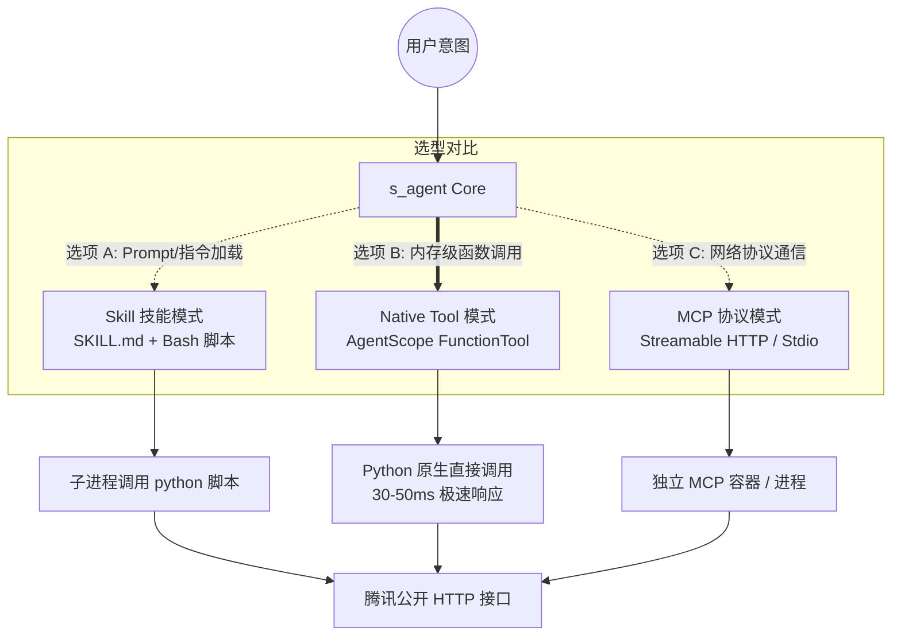
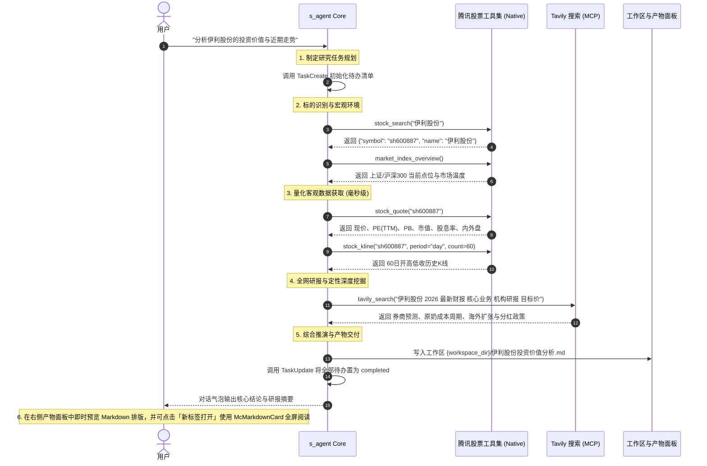

# 腾讯股票 + Tavily 混合投研系统架构设计规范

> 日期：2026-10-01  
> 状态：提案中 (Proposed)  
> 责任团队：s_agent Core Team  
> 关联代码：`/media/data/git/股票分析/scripts/tencent_stock.py`、`server/agent/core.py`、`server/tools/`

---

## 一、 背景与业务目标

### 1.1 背景与痛点
在量化与股票研究场景中，大模型 Agent 需结合客观金融数据与主观研报资讯输出投研报告：
1. **东方财富接口的局限**：原方案或主流社区方案常使用东方财富（EastMoney）相关接口，但实测存在**严格的 IP 访问频率限制、反爬限制（易 403/封 IP）、需携带复杂临时 Cookie/Token、接口经常变更**等问题，稳定性无法满足高可用 Agent 的生产要求。
2. **腾讯股票接口的独特优势**：腾讯财经/自选股（`qt.gtimg.cn`、`web.ifzq.gtimg.cn`、`smartbox.gtimg.cn`）提供了极其轻量、**完全免鉴权、零 Token、毫秒级响应（30~80ms）、高并发稳定**的公开 HTTP 接口，且本地已有成熟验证的封装脚本 [`/media/data/git/股票分析/scripts/tencent_stock.py`](file:///media/data/git/股票分析/scripts/tencent_stock.py)。
3. **纯行情数据的能力缺口**：腾讯公开接口聚焦于量价行情（快照、盘口、分时、K线）与基本估值（PE/PB/市值/股息率），**不提供深度的全市场研报全文、公司重大事件解读、最新行业政策与舆情**。

### 1.2 核心设计目标
- **确定性混合架构**：彻底放弃东方财富接口，构建 **“腾讯股票（确定性高频量化数据） + Tavily（非结构化全网金融资讯/研报搜索）”** 的混合投研闭环；
- **架构形态决策**：深入对比 **Skill（技能包）**、**Native Tool（内置原生工具）**、**MCP（Model Context Protocol 服务）** 三种技术形态的优劣，确立最适合 `s_agent` 当前阶段及未来演进的工程实现方式；
- **零摩擦使用体验**：实现自动代码联想匹配、强类型参数校验、开箱即用的免人工审核（HITL ALLOW）以及与右侧产物面板的无缝联动。

---

## 二、 形态选型深度权衡：Skill vs. Native Tool vs. MCP

将腾讯股票接口赋能给智能体，有三种主流技术路径：



### 2.1 三种技术形态多维对比表

| 维度 | 选项 A：Skill（技能包） | 选项 B：Native Tool（内置原生工具）⭐推荐 | 选项 C：MCP（Model Context Protocol 服务） |
|---|---|---|---|
| **调用原理** | 运行时将 `SKILL.md` 注入上下文，Agent 通过 `Bash` 工具调用 CLI 脚本 | Python 函数直接注册进 AgentScope `Toolkit`，由模型直接发起 Function Calling | 启动独立 MCP 服务（HTTP/Stdio），通过 MCP JSON-RPC 协议进行通信 |
| **执行延迟** | 慢（约 300~800ms）：模型先决定执行 Bash，再创建子进程运行 Python 解释器 | **极快（约 30~80ms）**：内存直接调用，无进程切换开销，仅网络 I/O 耗时 | 中等（约 100~200ms）：经过 JSON 序列化、HTTP/Stdio RPC 通信及反序列化 |
| **参数校验与类型系统** | 差：靠自然语言 Prompt 描述命令行参数，模型易拼错参数或漏传标志位 | **极优**：Pydantic / Type Hints 自动生成 JSON Schema，模型遵循度极高 | **优**：MCP 协议规范标准的 Tool Schema 定义 |
| **运维与部署成本** | **极低**：只需一个 Markdown 文件和现存脚本，无需改动后端代码 | **极低**：直接内置于 `server/tools/`，无需额外端口、Docker 容器或进程管理 | 较高：需要部署和维护独立的 MCP Server，配置健康检查与容器编排 |
| **系统稳定性** | 受制于宿主机 Bash 环境、Shell 字符转义及 Python 虚拟环境依赖 | **极高**：由后端直接托管，异常捕获严密，不会出现子进程僵死或引号截断 | 依赖跨进程通信与长连接状态，存在 Session 断开或网络波动风险 |
| **权限与安全（HITL）** | 差：依赖 Bash 工具权限，若开启“严格/危险”模式，每次跑脚本都需用户确认弹窗 | **极优**：可声明 `PermissionBehavior.ALLOW`，只读行情零打扰、高安全 | 需在 `server/tools/mcp.py` 中编写特定中间件来豁免确认弹窗 |
| **跨系统通用性** | 弱（受限于本地路径或特定 Agent CLI 规范） | 中等（专属于 s_agent / AgentScope 生态） | **极优**：Cursor、Claude Desktop、Antigravity 均可通用 |
| **上下文消耗** | 较大：每次命中 Skill 需完整加载 `SKILL.md` 到 System/User Prompt | **极小**：仅工具描述（Tool Definitions）占用少量上下文，按需调用 | **极小**：仅工具描述占用上下文 |

### 2.2 核心权衡分析

1. **为什么不单独采用 Skill？**
   - 股票行情是**高频、结构化、即时**的操作。若做成 Skill，Agent 每次查询必须调用 `Bash(command="python /path/to/tencent_stock.py quote ...")`：
     - 容易触发 Bash 命令的 HITL 人工确认弹窗；
     - 子进程启动开销大；
     - 命令行输出为文本，模型需自行二次解析提取数字，容易出现截断或格式紊乱。
2. **为什么现阶段不优先做成独立 MCP？**
   - 现有的 Tavily 是因为本身官方提供了标准 MCP 服务镜像，才配置在 `S_AGENT_MCP_SERVERS` 中；
   - 腾讯股票接口极简（仅几个 HTTP GET 请求），如果为了包装这几个请求专门再起一个 Docker 容器或常驻进程，会**严重增加项目运维复杂度、内存占用与网络故障点**。
3. **为什么 Native Tool 是当前最优解？**
   - 性能最高、延迟最低（毫秒级）；
   - 利用 AgentScope 原生 `FunctionTool`，Schema 强类型约束；
   - 可以为只读行情声明 `PermissionBehavior.ALLOW`，彻底免去人工确认弹窗；
   - 易于维护：直接基于已有的 `tencent_stock.py` 提炼入 `server/tools/stock.py` 即可。

### 2.3 最佳落地决策：“分层协同架构（Tiered Architecture）”

综合考量，最优解不是三选一互斥，而是**“分层各取所长”**：
- **底层执行层（Execution Layer） $\rightarrow$ 做成 Native Tool（`server/tools/stock.py`）**：
  提供原子化、极速、安全免审的量价、K线、分时、估值、搜索工具，注册到 AgentScope Toolkit。
- **业务方法论层（Methodology Layer） $\rightarrow$ 沉淀为投研 Skill（`stock-research`）**：
  将“如何运用腾讯数据 + Tavily 搜索撰写专业研报”的标准作业程序（SOP）编写为 Skill，包含分析框架、杜邦拆解要点、Markdown 表格交付规范等。
- **外部生态兼容（Optional Extension） $\rightarrow$ 预留 MCP 导出入口**：
  核心逻辑封装在独立的 service/工具类中，若未来外部软件（如 Cursor）需要使用，只需一行命令暴露为 FastMCP 即可，架构无耦合。

---

## 三、 混合投研系统架构设计 (Hybrid System Architecture)

### 3.1 职责分工边界

```
┌────────────────────────────────────────────────────────┐
│                   s_agent 核心工作台                   │
└───────────────────────────┬────────────────────────────┘
                            │
            ┌───────────────┴───────────────┐
            ▼                               ▼
┌───────────────────────┐       ┌───────────────────────┐
│     腾讯股票工具集     │       │     Tavily 搜索工具    │
│    (Native Toolkit)   │       │      (MCP Server)     │
├───────────────────────┤       ├───────────────────────┤
│ • 股票代码智能联想    │       │ • 宏观经济与产业政策  │
│ • 实时行情与五档盘口  │       │ • 最新公司公告与财报会│
│ • 市盈率/市净率/估值  │       │ • 券商机构研报核心观点│
│ • 历史 K 线序列(复权) │       │ • 行业竞争格局与壁垒  │
│ • 当日/多日分时走势   │       │ • 风险舆情与管理层异动│
│ • 大盘指数环境(Beta)  │       │                       │
└───────────────────────┘       └───────────────────────┘
            │                               │
            └───────────────┬───────────────┘
                            ▼
┌────────────────────────────────────────────────────────┐
│                   交付物自动生成与闭环                 │
│  - 工作区根目录生成《XXX投资价值分析.md》 (供右侧预览/下载) │
│  - 界面对话气泡富文本总结 (微信风格主题适配)            │
│  - 新标签打开独立沉浸式 McMarkdownCard 富文本渲染      │
└────────────────────────────────────────────────────────┘
```

### 3.2 投研工作流时序图 (Mermaid Sequence)



---

## 四、 工具集详细规范设计 (Tool Specification)

在 `server/tools/stock.py` 中封装以下标准函数，并转换为 AgentScope `FunctionTool`：

### 4.1 标的检索与解析：`stock_search`
```python
def stock_search(keyword: str) -> list[dict[str, Any]]:
    """搜索匹配股票代码、名称与市场类型。
    
    Args:
        keyword: 股票中文名称（如'贵州茅台'）、拼音简称（如'gzmt'或'pa'）或数字代码（如'600519'）
    Returns:
        包含匹配证券列表的字典数组，每项包含 symbol (带前缀代码), code, name, market, type
    """
```

### 4.2 实时行情与基础估值：`stock_quote`
```python
def stock_quote(symbol: str) -> dict[str, Any]:
    """获取个股完整实时行情、买卖盘口及基本估值指标。
    
    Args:
        symbol: 规范代码，如 'sh600519', 'sz000858', 'hk00700', 'usAAPL' (亦支持纯数字自动容错)
    Returns:
        包含价格、涨跌幅、PE(动/静/TTM)、PB、换手率、振幅、量比、流通市值、总市值、外盘(主动买)、内盘(主动卖)、买卖五档挂单
    """
```

### 4.3 批量股票对比：`stock_batch_quotes`
```python
def stock_batch_quotes(symbols: list[str]) -> list[dict[str, Any]]:
    """批量获取多只股票的简要行情与估值，用于同行横向对比与监控池。
    
    Args:
        symbols: 股票代码列表，单次上限 50 只
    Returns:
        每只标的的核心指标对比：代码、名称、现价、涨跌幅、成交额、总市值、PE
    """
```

### 4.4 历史 K 线走势：`stock_kline`
```python
def stock_kline(
    symbol: str,
    period: str = "day",
    count: int = 120,
    fq: str = "qfq",
) -> list[dict[str, Any]]:
    """获取股票的历史 K 线序列，用于技术分析、均线系统计算与形态判断。
    
    Args:
        symbol: 股票代码
        period: 周期类型，支持 'day'(日K), 'week'(周K), 'month'(月K), 'm5', 'm15', 'm30', 'm60'
        count: 获取的K线根数，默认 120 根
        fq: 复权类型，'qfq'(前复权，推荐用于分析走势), 'hfq'(后复权), 'none'(不复权)
    Returns:
        按时间升序排列的 K 线字典数组：date/time, open, close, high, low, volume, amount
    """
```

### 4.5 日内分时明细：`stock_minute`
```python
def stock_minute(symbol: str, days: int = 1) -> list[dict[str, Any]]:
    """获取当日或近 5 日的分时量价数据，用于分析日内异动与分时均线支撑。
    
    Args:
        symbol: 股票代码
        days: 1 表示当日分时，5 表示近 5 日分时
    Returns:
        逐分钟的数据点列表：time (HH:MM), price, volume, avg_price (分时均价)
    """
```

### 4.6 盘口博弈多空透视：`stock_handicap`
```python
def stock_handicap(symbol: str) -> dict[str, Any]:
    """获取买卖盘口大单与小单分布比例，辅助判断主力资金与散户博弈态势。
    
    Args:
        symbol: 股票代码
    Returns:
        buy_big_ratio (大单买入比), buy_small_ratio (小单买入比),
        sell_big_ratio (大单卖出比), sell_small_ratio (小单卖出比)
    """
```

### 4.7 全市场宏观基准：`market_index_overview`
```python
def market_index_overview() -> list[dict[str, Any]]:
    """获取大盘核心基准指数的实时行情快照，用于评估系统性市场环境 (Beta)。
    
    Returns:
        包含上证指数、深证成指、创业板指、科创50、沪深300、恒生指数的最新点位、涨跌额、涨跌幅、成交额
    """
```

---

## 五、 安全性、权限控制（HITL）与性能设计

### 5.1 人机协同（HITL）权限策略
- 股票查询类接口均为**纯读操作（Read-Only）**，无磁盘写操作或破坏性网络副作用；
- 在 `server/agent/core.py` 中注册 `FunctionTool` 时，一律指定：
  ```python
  permission=PermissionDecision(
      behavior=PermissionBehavior.ALLOW,
      message="Read-only public financial market data query",
  )
  ```
  保证 Agent 在进行深度研究连环调用多只股票、K线数据时不会频繁弹出中断卡片阻断分析流。

### 5.2 本地短时缓存（In-Memory TTL Cache）
- **高频防刷与性能保障**：
  - K 线历史数据与代码联想搜索结果具有时效稳定性；
  - 引入轻量级内存缓存（如 `cachetools.TTLCache` 或基于时间戳的简易缓存）：
    - `stock_search` 缓存 10 分钟；
    - `stock_kline` 缓存 60 秒；
    - `stock_quote` 缓存 3 秒（避免同一轮 Prompt 中重复请求）；
  - 确保即使 Agent 短时间内连续调用多次，也能在 0ms 级别直接返回内存结果。

### 5.3 错误降级机制
- 腾讯接口容错：当个别字段解析异常或返回空时，保持字段返回 `None` 而不直接抛出未捕获异常中断 Agent 对话；
- 网络异常重试：网络抖动时提供 1 次退避重试（Backoff Retry），若仍失败则返回清晰的错误原因提示，引导 Agent 调整查询参数。

---

## 六、 实施计划与里程碑 (Roadmap)

| 阶段 | 任务目标 | 核心产出物 | 验证标准 |
|---|---|---|---|
| **Phase 1: 核心工具封装** | 提炼 `tencent_stock.py`，构建标准 `server/tools/stock.py` | `server/tools/stock.py`<br>`tests/test_stock_tools.py` | 单元测试覆盖全部 7 个工具，包含缓存、代码纠错与异常处理，pytest 100% 通过 |
| **Phase 2: Toolkit 接入与 HITL 配置** | 将股票工具注册到 `server/agent/core.py`，配置免审权限与系统 Prompt 引导 | `server/agent/core.py` | 启动服务，Agent 能在会话中自主识别意图并调用股票工具 |
| **Phase 3: 混合投研实战与 Skill 沉淀** | 联合 Tavily 进行完整研报生成测试，编写投研方法论 Skill | `docs/skills/stock-research/SKILL.md`<br>工作区自动化产物交付验证 | 以伊利股份/贵州茅台等真实标的进行全流程测试，验证产物面板预览与新标签打开效果 |

---

## 七、 结论与建议总结

1. **果断弃用东方财富**：避免了限流反爬风险与账号凭证运维负担；
2. **底层核心坚持 Native Tool**：毫秒级响应、强类型 Schema、零容器运维、免弹窗打扰；
3. **上层协同采用混合机制**：腾讯负责高频硬核量价数据，Tavily 负责全网深度研报与舆情，双剑合璧；
4. **架构预留扩展性**：工具核心逻辑保持纯 Python 解耦，未来可按需一键导出为外部 MCP Server。
