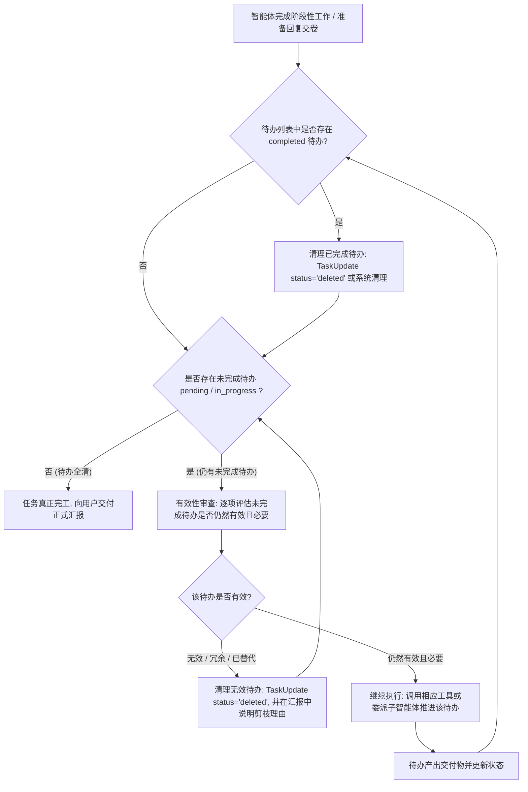

# 待办任务生命周期与完工闭环控制设计规范

> 📌 核心规范  
> **制定日期**：2026-10-02  
> **文档状态**：PROPOSED / IN_REVIEW  
> **分类**：`docs/specs/`

---

## 一、需求背景与痛点分析

### 1.1 现状痛点
在多步骤自主分析任务（如深度投研、同业对比、财务建模）中，智能体通过 `TaskCreate` 创建工作大纲与待办清单。然而在实际运行中暴露出两个核心设计缺陷：
1. **已完成待办未清理与列表堆积**：
   - 智能体将子步骤置为 `completed` 后，这些待办任务长期滞留在 `AgentState.tasks_context` 和前端待办面板中；
   - 堆积的已完成任务挤占上下文窗口，并在前端产生陈旧干扰信息。
2. **任务半途而废与未完成待办悬挂（提前收工）**：
   - 智能体在完成前期部分子任务（例如写出初步报告）后，误以为“整体任务已完成”，直接在对话气泡中总结交差并退出 ReAct 循环；
   - 待办列表中规划的后续关键步骤（如竞品横向对比、红队风控审查、敏感性测算）仍停留在 `pending` 或 `in_progress` 状态，沦为“悬挂未竟事项”。

### 1.2 用户核心诉求
> “一个任务完成后，要清理一下完成的待办；如果还有待办没有完成，这个时候应该要检查未完成的待办是否有效，如果有效，那么要完成待办未完成的任务。”

---

## 二、架构设计：双重闭环机制

为保证待办任务的自洁性与执行完备性，系统采取**认知规范（Cognitive SOP）**与**中间件守卫（Middleware Guardrail）**双重闭环设计。



---

## 三、详细设计与实施方案

### 3.1 认知层：Prompt SOP 重构（`server/agent/core.py`）
重构系统提示词中的【四步标准协同 SOP】与【待办动态生命周期与完工闭环公约】：

1. **待办创建与粒度控制**：
   - 使用 `TaskCreate` 创建目标清晰、产出明确的待办子任务。
2. **完成即清理（Clean on Completion）**：
   - 当某个待办任务执行完毕、相关交付物（研报/模型/图表）已落盘后，立即调用 `TaskUpdate(task_id=..., status="deleted")` 将其清理移出看板，保持待办看板高度聚焦于当前未竟事项。
3. **完工强校验与有效性闭环（Completion Checklist）**：
   - 在准备向用户作最终汇报前，**必须调用 `TaskList()` 检查当前待办状态**：
     - **清理已完成项**：若有残留的 `completed` 任务，必须清理；
     - **未完成待办审查**：若仍存在 `pending` 或 `in_progress` 的待办：
       - **严禁直接结束交卷！**
       - **逐一有效性审查**：
         - **若无效/冗余**（例如已被前序分析完全覆盖、外部条件不适用）：调用 `TaskUpdate(task_id=..., status="deleted")` 进行清理剪枝，并在总结中简要向用户陈述理由；
         - **若仍然有效**：**必须立即继续调用工具或委派对应垂直子智能体执行该任务**，直至完成并产出成果！
     - 只有当待办列表中不存在任何未完成的有效待办时，才允许向用户输出最终汇报并收尾。

---

### 3.2 守卫层：`TodoLifecycleMiddleware` 中间件拦截守护

在 `server/agent/` 中实现专用的 `TodoLifecycleMiddleware`（继承 `MiddlewareBase`）：
1. **自动辅助清理**：
   - 在每个推理周期开始时，若发现 `tasks_context.tasks` 中存在已经置为 `completed` 的任务，自动将其从活跃任务上下文中清理移除，避免陈旧任务累积；
2. **提前收尾拦截与反思引导**：
   - 当智能体即将输出最终文本（本轮推理没有发起任何 tool call），但 `tasks_context.tasks` 中仍然存在处于 `pending` 或 `in_progress` 状态的待办时；
   - 触发守卫拦截（单轮最多拦截 2 次，避免逻辑死循环）：
     - 向上下文动态注入 `<system-reminder>`：
       ```xml
       <system-reminder>
       【待办未竟与有效性闭环提醒】：
       检测到当前待办清单中仍有未完成的待办任务：
       - #{task_id}: {subject}（状态: {state}）

       根据待办闭环公约，当前不能直接交卷收尾：
       1. 请清理已完成的待办；
       2. 请检查未完成待办是否依然有效且必要：
          - 若无效/冗余/已不适用：请调用 TaskUpdate(task_id='...', status='deleted') 进行清理剪枝，并向用户说明原因；
          - 若仍然有效：严禁提前结束！必须立即调用工具或委派子智能体执行该待办，直至完成交付！
       </system-reminder>
       ```
     - 强制将推理流退回重算，促使模型审查未完成任务的有效性，并继续调用工具推进，直至待办清空或有效任务全部完工。

---

### 3.3 状态与前端同步（`server/main.py` & 前端）
1. 在 SSE 事件流中，每次待办工具调用后或状态变更后，触发 `task_todos_changed` 事件，前端实时刷新看板；
2. 当所有有效任务完成且清理后，前端看板显示“暂无待办任务”，状态清晰明了；
3. 用户若在历史折叠中勾选“显示已删除”，仍可按需溯源审计。

---

## 四、验证计划

1. **单元测试与集成测试**：
   - `test_todo_lifecycle_middleware_clean_completed`：验证 `completed` 任务在闭环时被自动清理；
   - `test_todo_lifecycle_middleware_intercept_uncompleted`：验证当仍存在 `pending` 任务且模型试图结束时，中间件成功注入提醒并促使继续推理；
   - `test_todo_lifecycle_middleware_max_retries_guard`：验证防死循环计数器生效，达到最大重试次数后安全放行；
2. **端到端测试**：
   - 模拟多步骤任务（如：创建待办 A、B，A 执行后，验证中间件促使智能体检查 B 并继续执行 B，B 完成后待办清空）。
