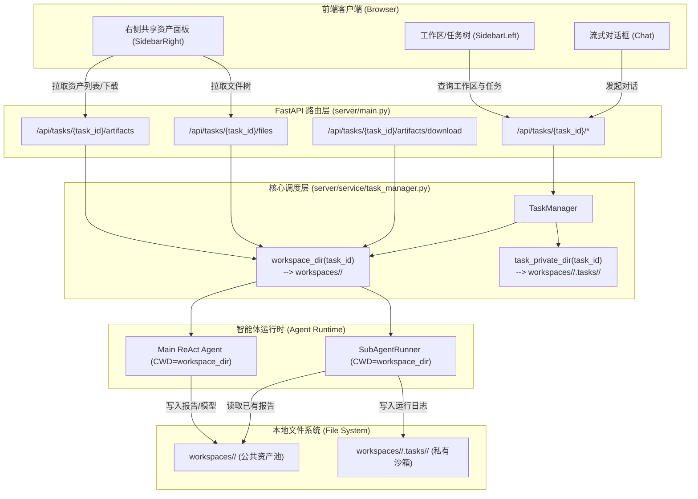

# 工作区级共享产出物与跨任务资产协同架构设计

> 📌 设计规范文档  
> **创建日期**：2026-10-02  
> **状态**：评审中 (In Review)  
> **归档位置**：`docs/specs/2026-10-02-workspace-shared-artifacts-design.md`

---

## 1. 需求背景与核心价值

### 1.1 现状痛点
在现有架构中，工作区（Workspace）仅作为前端侧边栏的任务逻辑分组（由 `registry.json` 维护），而在物理文件系统层面，每个任务（Task）被分配了相互孤立的物理目录：
```text
workspaces/
├── task-1-1790830074963/    <-- 伊利股份分析产出物（被锁在此目录中）
│   └── 伊利股份_投资价值深度分析.md
└── task-2-1790849550287/    <-- 海康威视分析产出物（被锁在此目录中）
    └── 海康威视_投资价值深度分析.md
```

这导致以下核心痛点：
1. **资产孤岛化**：同一个投研工作区（如“消费乳制品赛道调研”或“个人自选股组合”）下的多个任务无法相互读取已生成的分析报告、估值底稿、Excel/CSV 数据集或 Python 测算脚本。
2. **重复劳动与割裂**：任务 A 沉淀的个股深度分析，在任务 B 进行同行竞争格局横向对比时，大模型和子智能体完全无法访问，只能从头联网搜索并重复计算。
3. **工作区概念名不副实**：用户期望“工作区”是一个共同的项目文件夹，团队或个人在其中的所有任务都在向该工作区累积资产。

### 1.2 核心设计目标
1. **物理存储锚点上移**：将任务执行的 Working Directory 与产出物存储目录从 `workspaces/<task_id>/` 提升至 `workspaces/<workspace_id>/`。
2. **跨任务资产天然共享**：同一工作区下的所有任务（包括其派生的所有子智能体）共享同一个工作区根目录，拥有共同的文件树与交付物池。
3. **任务隔离与共享解耦**：
   - **公共成果（Artifacts）**：直接落盘在工作区根目录下，全员共享、跨任务可见；
   - **私有运行态（Sessions/Dumps）**：收敛到隐藏的 `.tasks/<task_id>/` 目录下，互不干扰且不对外展示。
4. **生命周期精细化防护**：删除任务仅清理该任务的私有临时数据和会话状态，**严禁物理误删工作区公共文件**；只有删除整个工作区时才清空该目录。
5. **存量数据无缝平滑迁移**：自动将散落在历史 `workspaces/task-xxx/` 目录中的文件迁移至对应的工作区共享目录中。

---

## 2. 物理目录拓扑演进

```
workspaces/
├── default/                               <-- 默认工作区共享根目录（全任务共享资产池）
│   ├── 伊利股份_投资价值深度分析.md         <-- 任务 1 交付报告
│   ├── 海康威视_投资价值深度分析.md         <-- 任务 2 交付报告
│   ├── 乳制品行业与安防估值对比.xlsx       <-- 任务 3 测算底稿
│   ├── charts/                            <-- 共享可视化图表目录
│   │   ├── yili_pe_band.png
│   │   └── hik_revenue_trend.png
│   └── .tasks/                            <-- 任务私有沙箱隔离区（点前缀隐藏，产物扫描自动忽略）
│       ├── task-1-1790830074963/
│       │   └── sessions/                  <-- Sub-Agent 内部追踪流水与临时快照
│       ├── task-2-1790849550287/
│       │   └── sessions/
│       └── task-3-1790894040998/
│           └── tool_result-cache.txt      <-- 巨型工具输出截断暂存文件
├── workspace-dairy-research/              <-- 自定义工作区共享目录
│   ├── 伊利股份_深度分析.md
│   ├── 蒙牛乳业_财务拆解.md
│   ├── 乳企横向竞争模型.py
│   └── .tasks/
└── registry.json                          <-- 全局工作区与任务元数据索引
```

### 目录分层规则：
1. **工作区公共交付区（`workspaces/<workspace_id>/`）**：
   - 存放所有正式的业务产出物：Markdown 报告、Excel 表格、代码脚本、图表等。
   - 所有任务及其子智能体均以此目录作为 CWD（当前工作目录）。
2. **任务私有隔离区（`workspaces/<workspace_id>/.tasks/<task_id>/`）**：
   - 存放单次任务运行期间的瞬态中间过程：子智能体运行日志、超大工具输出暂存文件、调试转储等。
   - 系统内部自动将其标记为内部系统文件，不会被作为产物推送到前端。

---

## 3. 后端架构改造方案



### 3.1 TaskManager 改造 (`server/service/task_manager.py`)

1. **工作区目录映射改造**：
   ```python
   def get_workspace_dir(self, workspace_id: str) -> Path:
       """获取指定工作区的物理共享根目录。"""
       ws_dir = self.root_dir / workspace_id
       ws_dir.mkdir(parents=True, exist_ok=True)
       return ws_dir

   def workspace_dir(self, task_id: str) -> Path:
       """返回指定任务所属工作区的共享目录（兼容原有接口签名）。"""
       task = self._tasks.get(task_id)
       workspace_id = task.workspace_id if task else "default"
       return self.get_workspace_dir(workspace_id)

   def task_private_dir(self, task_id: str) -> Path:
       """返回指定任务专属的内部私有沙箱目录。"""
       task = self._tasks.get(task_id)
       workspace_id = task.workspace_id if task else "default"
       pdir = self.root_dir / workspace_id / ".tasks" / task_id
       pdir.mkdir(parents=True, exist_ok=True)
       return pdir
   ```

2. **生命周期与安全删除改造**：
   ```python
   async def delete_task(self, task_id: str) -> bool:
       """删除任务：清理元数据、Redis状态和任务私有临时目录，保留工作区共享文件。"""
       if task_id not in self._tasks:
           return False

       task = self._tasks[task_id]
       # 1. 仅物理删除该任务的私有临时沙箱，绝不能清空工作区！
       private_dir = self.root_dir / task.workspace_id / ".tasks" / task_id
       shutil.rmtree(private_dir, ignore_errors=True)

       # 2. 清理内存缓存与Redis对话
       del self._tasks[task_id]
       self._agents.pop(task_id, None)
       self._agent_configs.pop(task_id, None)
       self._task_locks.pop(task_id, None)
       self._save()

       await agent_state_store.delete(task_id)
       return True

   async def delete_workspace(self, workspace_id: str) -> bool:
       """删除整个工作区：级联删除所有任务，并物理清理该工作区整个目录。"""
       if workspace_id == "default" or workspace_id not in self._workspaces:
           return False

       # 级联删除任务元数据
       task_ids = [t.id for t in self._tasks.values() if t.workspace_id == workspace_id]
       for tid in task_ids:
           await self.delete_task(tid)

       # 物理删除工作区全量目录
       shutil.rmtree(self.get_workspace_dir(workspace_id), ignore_errors=True)

       del self._workspaces[workspace_id]
       self._save()
       return True
   ```

### 3.2 过滤规则与产物嗅探改造 (`server/main.py`)

1. **忽略系统级私有目录**：
   ```python
   IGNORED_WORKSPACE_PARTS = {
       ".git",
       ".tasks",        # 新增：忽略任务私有隔离目录
       "sessions",
       "__pycache__",
       ".pytest_cache",
       ".ruff_cache",
       ".mypy_cache",
       "node_modules",
   }
   ```
2. **多任务产物推流（`_new_artifact_frames`）**：
   - 嗅探扫描 `workspace_dir(task_id)`（即 `workspaces/<workspace_id>`）；
   - 在轮次执行前后检查 `mtime >= since_ts` 的新增/修改文件；
   - 任何由当前任务触发产生的新文件，通过 SSE 实时广播到前端。

### 3.3 智能体系统提示（System Prompt）增强 (`server/agent/core.py`)

在 `server/agent/core.py` 和 `server/agent/subagents/templates.py` 的 Environment Prompt 中注入资产发现与复用公约：
```markdown
【工作区共享资产协同公约】
你当前处于工作区：{workspace_id}，物理工作路径为：
{workspace_dir}

⚠️ 核心原则：
1. 本工作区下聚合了同项目/同赛道的所有历史研究产出物；
2. 启动新任务或回答用户前，优先通过 `ListDirectory` 检查工作区现有文件；
3. 若存在关联公司或竞品的分析报告（如已存在 `海康威视_投资价值深度分析.md`），在执行同业对比或行业综述时，必须直接读取（`Read`）并复用其中的事实数据与估值假设，避免重复检索和推演；
4. 撰写新交付物时，严格遵循规范的动态语义命名（如 `<标的名称>_深度分析.md`），杜绝使用 `test.md`、`report.md` 等易冲突的通用名称。
```

---

## 4. 并发与冲突防护机制

当用户在同一个工作区中先后或交替推进多个任务时，存在潜在的文件读写竞争：

| 场景 | 风险分析 | 应对策略 |
| :--- | :--- | :--- |
| **不同标的分析**（例：任务1分析伊利，任务2分析蒙牛） | 无同名冲突，属于纯增量积累 | 语义化命名机制（`<标的>_<报告类型>.md`）保障自然解耦 |
| **协同引用**（例：任务2读取任务1产出的报告） | 读共享，无冲突 | 操作系统级读无锁，子智能体原生支持高并发读取 |
| **迭代更新**（例：任务3对任务1的旧模型进行修正） | 文件写覆盖 | Agent 默认使用 `Edit` 进行局部增量修补；写入前执行文件存在性检查 |
| **并发任务同时写入** | 极低概率但可能发生竞争 | 保留任务级互斥锁，并在后续扩展工作区级写文件互斥锁（File Advisory Lock） |

---

## 5. 前端交互与展现升级

1. **资产全貌透视**：
   - 用户在侧边栏切换同一个工作区下的不同任务时，右侧栏的“文件树（FileTreePane）”和“下载面板（DownloadPane）”保持连贯，完整呈现该工作区已积累的全部知识资产。
2. **跨任务直接预览与引用**：
   - 用户在任务 B 的界面中，可以直接点击右侧文件树中的任务 A 产物（例如 `伊利股份_投资价值深度分析.md`）进行即时 Markdown 预览，无需频繁切换任务。
3. **工作区打包导出**：
   - 右侧下载面板提供“一键打包下载本工作区全量研究成果（ZIP）”，输出包含全套分析报告与模型的投研资产包。

---

## 6. 存量数据平滑迁移策略

为保证系统热更新后，用户之前在“伊利股份”、“海康威视”任务中生成的成果不丢失，需在 `TaskManager.__init__` 中执行自动增量迁移补丁：

```python
def _migrate_legacy_workspaces(self) -> None:
    """自动将旧版本按 task-id 割裂存放的文件迁移到对应 workspace 共享目录下。"""
    for task_id, task in self._tasks.items():
        legacy_dir = self.root_dir / task_id
        if legacy_dir.exists() and legacy_dir.is_dir():
            target_ws_dir = self.get_workspace_dir(task.workspace_id)
            for item in legacy_dir.iterdir():
                if item.name.startswith(".") or item.name in IGNORED_WORKSPACE_PARTS:
                    continue
                target_file = target_ws_dir / item.name
                if not target_file.exists():
                    shutil.move(str(item), str(target_file))
                    logger.info("Migrated legacy artifact %s -> %s", item, target_file)
            # 将旧任务目录中的 sessions 归档到 .tasks/<task_id>/sessions
            legacy_sessions = legacy_dir / "sessions"
            if legacy_sessions.exists():
                target_priv = self.task_private_dir(task_id) / "sessions"
                target_priv.parent.mkdir(parents=True, exist_ok=True)
                if not target_priv.exists():
                    shutil.move(str(legacy_sessions), str(target_priv))
            # 清除旧空目录
            shutil.rmtree(legacy_dir, ignore_errors=True)
```

---

## 7. 实施计划 (Implementation Steps)

1. **Step 1：后端数据层与迁移逻辑改造**
   - 修改 [`server/service/task_manager.py`](file:///media/data/git/s_agent/server/service/task_manager.py)：实现 `get_workspace_dir`、`workspace_dir`（返回工作区路径）、`task_private_dir`、重构 `delete_task`（保护工作区），并加入存量迁移。
2. **Step 2：路由层与产物过滤适配**
   - 修改 [`server/main.py`](file:///media/data/git/s_agent/server/main.py)：在 `IGNORED_WORKSPACE_PARTS` 中增加 `.tasks`，调整文件扫描与打包下载范围。
3. **Step 3：智能体工作区共享提示词注入**
   - 修改 [`server/agent/core.py`](file:///media/data/git/s_agent/server/agent/core.py) 与 [`server/agent/subagents/templates.py`](file:///media/data/git/s_agent/server/agent/subagents/templates.py)：注入共享工作区协同感知与动态语义命名规则。
4. **Step 4：自动化测试套件验证**
   - 编写针对工作区共享产物、跨任务文件读写、任务删除保护以及存量目录迁移的完整单元测试。
